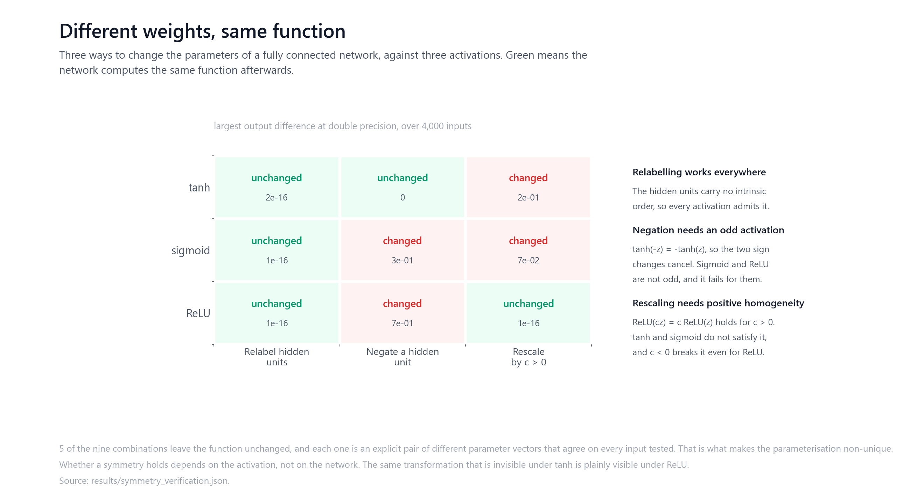
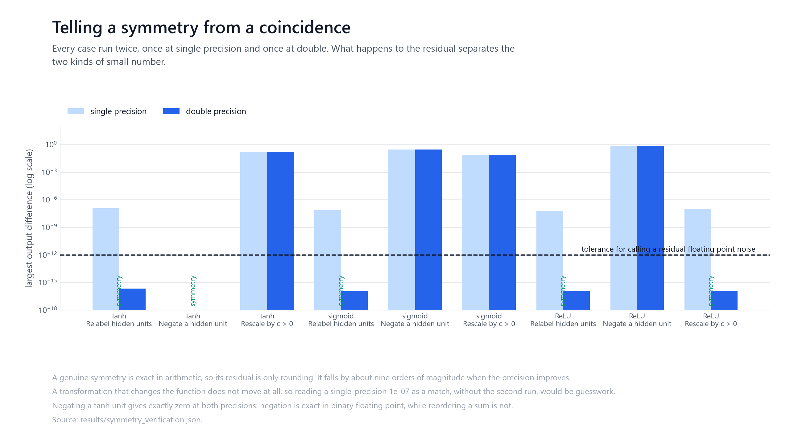
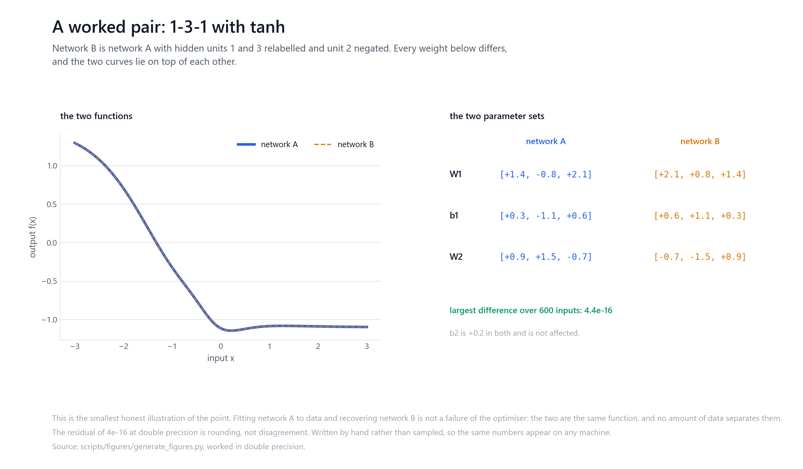

# Neural network parameter symmetries

If two networks produce the same output on every input, must their weights be the
same? No. This repository constructs explicit pairs of networks with different
parameters and the same function, and checks which transformations do that for
which activation.

It accompanies a TUM Mathematics seminar on neural network identification,
supervised by Prof. Massimo Fornasier and Dr. Alessandro Scagliotti. The
symmetries demonstrated here are established results, not findings of this
project. What the code contributes is a careful numerical verification of them.



## What this does and does not establish

It establishes **non-uniqueness**, in the only direction a finite computation can.
Each verified case is a concrete pair of different parameter vectors whose outputs
agree to rounding on every input tested, which is enough to show the
parameterisation is not unique.

It does **not** establish identifiability. Showing that the remaining parameter
sets are the *only* ones representing a given function is a statement about all
parameterisations and all inputs. A sampled comparison cannot prove it, and this
repository does not attempt to. For formal statements, and for the hypotheses
they require, see the references.

The code contains no trained model, no dataset and no benchmark.

## Definitions used here

The terms are used in these senses throughout, and nowhere more loosely.

**Functional equivalence.** Two parameter vectors are functionally equivalent if
they define the same input-output map. Verified here only as agreement to a
numerical tolerance on a finite sample, which is evidence, not proof.

**Parameter symmetry.** A transformation of the parameters that leaves the
represented function unchanged. Whether a given transformation is a symmetry
depends on the activation.

**Permutation symmetry.** Relabelling the units of a hidden layer, applied as a
permutation of the rows of the incoming weights and biases together with the
matching permutation of the columns of the outgoing weights.

**Sign-flip symmetry.** Negating a hidden unit's incoming weights, its bias, and
its outgoing weights. This cancels only when the activation is odd.

**Positive scaling symmetry.** Multiplying a hidden unit's incoming weights and
bias by c and dividing its outgoing weights by c. This cancels only when the
activation is positively homogeneous, and only for c > 0.

## Setup

Architecture 5-10-8-1, fully connected, seed 42. Inputs are 4,000 draws from a
standard normal. There is no external dataset: the networks are randomly
initialised and never trained, because a symmetry of the parameterisation does
not depend on the parameters being fitted to anything.

Every case is run twice, once in single precision and once in double.

## What holds, and why

| Activation | Relabel units | Negate a unit | Rescale by c > 0 |
| --- | --- | --- | --- |
| tanh | unchanged | unchanged | changed |
| sigmoid | unchanged | changed | changed |
| ReLU | unchanged | changed | unchanged |

Five of the nine combinations leave the function unchanged.

**Relabelling holds everywhere.** The units of a hidden layer carry no intrinsic
order, so permuting them and permuting the outgoing columns to match is a symmetry
for any activation.

**Negation needs an odd activation.** tanh(-z) = -tanh(z), so negating a unit's
input and its output cancels. Sigmoid satisfies sigmoid(-z) = 1 - sigmoid(z), not
-sigmoid(z), and ReLU is not odd either, so for both the transformation changes
the function by an amount of order one.

**Rescaling needs positive homogeneity.** ReLU(cz) = c ReLU(z) holds for c > 0.
tanh and sigmoid do not satisfy it. The restriction to positive c is not a
technicality: with c < 0 the same construction changes the ReLU network's output
by 0.68 in the test here, and the implementation rejects a negative factor rather
than returning a wrong answer.

The bias must be scaled with the weights. Scaling only the weights moves the kink
and is not a symmetry at all, which `tests/test_symmetries.py` checks directly.

## Telling a symmetry from a coincidence



At single precision a genuine symmetry leaves a residual near 1e-07. So does
nothing else in particular, and that number alone does not distinguish "the same
function, computed with rounding" from "a slightly different function".

Running each case at both precisions separates them. A symmetry is exact in
arithmetic, so its residual is only rounding and falls by roughly nine orders of
magnitude, to around 1e-16. A transformation that changes the function does not
move at all.

| Case | Single precision | Double precision |
| --- | --- | --- |
| tanh, relabel | 1.2e-07 | 2.2e-16 |
| tanh, negate | 0 | 0 |
| tanh, rescale | 1.7e-01 | 1.7e-01 |
| ReLU, rescale | 1.0e-07 | 1.1e-16 |
| sigmoid, negate | 3.0e-01 | 3.0e-01 |

Negating a tanh unit gives exactly zero at both precisions. Negation is exact in
binary floating point and so is multiplying two negated numbers, so nothing is
lost. Relabelling reorders a sum, and floating point addition is not associative,
which is where its 1e-07 comes from. The residual is a property of the arithmetic,
not of the mathematics.

Anything below 1e-12 at double precision is treated here as rounding. That
threshold is stated rather than implied, because "the outputs are identical" would
be false: they agree to rounding.

The single-precision column is an order of magnitude, not a fixed number. Its
value depends on the summation order the platform chooses, and the same run
reports 1.0e-07 on one machine and 1.3e-07 on another. The double-precision
column is stable and is what the conclusions rest on.

## A worked pair



The smallest honest illustration. A 1-3-1 tanh network, weights written by hand,
and the same network with two hidden units relabelled and a third negated. Every
weight and bias in the hidden layer differs. The two functions agree to 4.4e-16
across the input range.

Fitting the first and recovering the second is not a failure of the optimiser.
They are the same function, and no quantity of data separates them.

## Reproducing

```bash
pip install -r requirements.txt

python -m src.symmetry_verification        # writes results/symmetry_verification.json
python -m unittest discover -s tests
python scripts/figures/generate_figures.py
python scripts/check_repository.py
```

The verification takes a few seconds and needs no data or GPU. Every number in
this README comes from `results/symmetry_verification.json`, and the repository
check fails if the two stop agreeing.

## Limitations

The comparison is over a finite sample of inputs from one distribution. That can
refute a claimed symmetry and can exhibit non-uniqueness, but it cannot establish
functional equivalence over the whole input space.

One architecture and one seed are used. The symmetries verified are properties of
the activation and the layer structure rather than of the particular weights, but
this repository demonstrates them rather than proving them.

The three transformations here do not exhaust the equivalences a network can
admit. Networks with dead or duplicated units, or with hidden layers wider than
the function requires, have further degeneracies that are not covered.

`src/identifiability_checks.py`, `src/activation_analysis.py` and
`src/symmetry_breaking.py` are exploratory and are not part of the verified
result. Their diagnostics are finite and numerical, and the activation labels in
them describe assumptions considered by the prototype rather than the hypotheses
of any published theorem.

## References

The symmetries verified here are standard. These are the sources the seminar
worked from:

- Fefferman, C. (1994). Reconstructing a Neural Net from Its Output. Revista Matematica Iberoamericana.
- Bona-Pellissier, Miche, and Malgouyres (2022). Parameter Identifiability of Neural Networks with ReLU, Tanh, and Sigmoid Activations.
- Petzka and Trimmel (2020). On the Identifiability of Neural Networks.

## Provenance

The seminar framing and the mathematics are not the author's own. The
implementation, the verification, the tests and the figures are.

## Licence

MIT. See [LICENSE](LICENSE).
