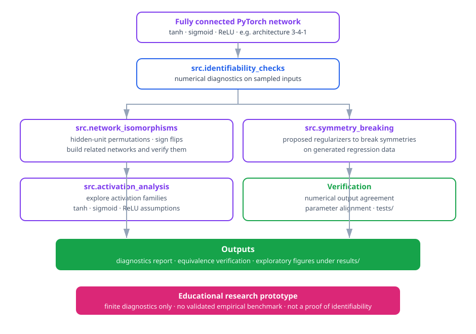

# Neural Network Identifiability Analysis

Two networks with identical weights always do the same thing. The far more interesting question is the reverse: if two networks produce the same output on every input, must their internal parameters be the same? This project is a small, educational playground for that question. It accompanies a TUM Mathematics seminar on neural-network identification supervised by Prof. Massimo Fornasier and Dr. Alessandro Scagliotti, and explores the parameter symmetries that let a fully connected network hide equivalent behaviour inside different weights - along with the numerical diagnostics that can expose them.

## Scope and limitations

The repository contains source code and exploratory notebooks, not a validated empirical benchmark. `experiments/` and `results/` intentionally contain no versioned experiment configurations, trained models, or numerical findings. Consequently, this project makes no claim of experimentally establishing identifiability for a trained model or activation family.

The checks are finite, numerical diagnostics. They can find parameter patterns such as exact clone pairs or inactive contributions on sampled inputs, but do not prove global functional equivalence or satisfy every hypothesis of a published identifiability theorem. In particular, the activation labels in the code describe the assumptions considered by this prototype; consult the cited papers for formal statements, definitions, and conditions.

## Included demonstrations

- Build small fully connected networks with `tanh`, sigmoid, or ReLU activations.
- Check exact/near-exact hidden-neuron clones, sampled non-degeneracy, and simple parameter diagnostics.
- Construct tanh networks related by hidden-unit permutations and sign flips, then verify their numerical output agreement and parameter alignment.
- Explore proposed symmetry-breaking regularizers on generated regression data.

The figure below shows how the demonstrations fit together:



## Setup

```bash
git clone https://github.com/mzquadri/Neural-Network-Identifiability-Analysis.git
cd Neural-Network-Identifiability-Analysis
python -m venv .venv
.venv\Scripts\activate  # On macOS/Linux: source .venv/bin/activate
pip install -r requirements.txt
```

## Run the examples

```bash
# Report diagnostics for a seeded toy network.
python -m src.identifiability_checks --architecture 3 4 1 --activation tanh

# Verify a generated permutation/sign-flip equivalent network and reject an unrelated one.
python -m src.network_isomorphisms --compare

# Generate exploratory activation and symmetry-breaking plots under results/.
python -m src.activation_analysis
python -m src.symmetry_breaking
```

The examples seed PyTorch where stated, but generated figures and any future training outcomes are local exploratory outputs. Keep the architecture, random seed, package versions, hardware, and complete training configuration when reporting a new result.

## Verification

```bash
python scripts/check_repository.py
python -m unittest discover -s tests -v
```

## References

- Fefferman, C. (1994). *Reconstructing a Neural Net from Its Output*. Revista Matematica Iberoamericana.
- Bona-Pellissier, Miche, and Malgouyres (2022). *Parameter Identifiability of Neural Networks with ReLU, Tanh, and Sigmoid Activations*.
- Petzka and Trimmel (2020). *On the Identifiability of Neural Networks*.

## License

Released under the [MIT License](LICENSE).
